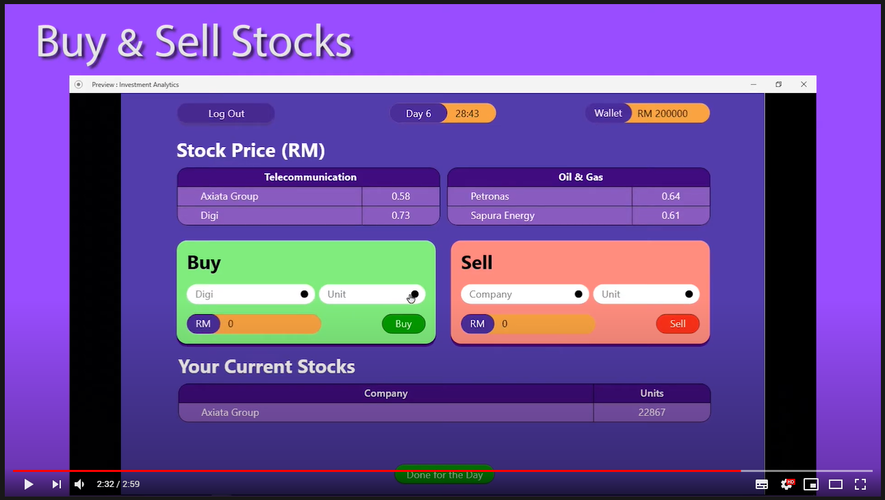

# Investment Analytics Game
Gold Award in 2nd Digitalised Internation Invention, Innovation & Design Competition, Johor 2019 (DIIID 2019). A prototype of stock trading simulation game based on Bursa Malaysia. Suitable for newbie stock trader as it only focus on fundamental analysis. Designed using Adobe XD.

# Click to watch

# Abstract
Investment Analytics Game is an educational tool to effectively teach shares trading using Mobile Apps that we developed. This Mobile Apps is different and unique from other online share trading game since it is seen as a ‘mini Stock Exchange’ where participants of the game will dictate the demand and supply of shares being traded –based on the news feed. It is a very interesting investment game as participants are able to apply data analytics and portfolio management. Throughout the share trading game period, participants will be able to learn all aspects and mechanics of share trading especially the price matching mechanism.  These stimuli may prepare the students for the real share trading of Bursa Malaysia because share trading is of a virtual or on-line trading system. The problem that triggered in introducing this innovative educational tool is that in the current on-line trading system, students are not able to easily understand the mechanics of share trading. Teaching them in that context will be a challenge too. Therefore, the simulation of trading must be introduced to students who majored in investment analysis. In this regard, Investment Analytics Game will be able to overcome the speculative nature of investment (which leads to gambling) and instill a real investor’s value. Participants will be thought to take calculated risks in deciding to buy or sell shares based on fundamental as well as technical sentiments This App has a high potential to be commercialized to other institutions of higher learning as well as to private investment seminar providers.

References:
1. https://docplayer.net/167002176-Elsbn.html
2. https://johor.uitm.edu.my/v1/images/segamat/BPJIA/i-PRESTIGE-2019.pdf
